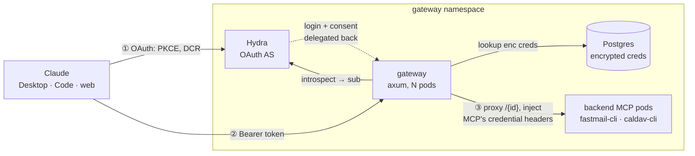

# mcp-gateway

An OAuth-fronted gateway for self-hosted MCP servers. Add any of your MCPs to
Claude (Desktop / mobile / web) as custom connectors without each one needing
its own OAuth — the gateway authenticates the user once and injects each MCP's
credential.

## Why this exists

MCP servers like [`fastmail-cli`](https://github.com/radiosilence/fastmail-cli)
and [`caldav-cli`](https://github.com/radiosilence/caldav-cli) are single-tenant
(one key, local stdio), but Claude's remote connectors need an
OAuth-authenticated HTTPS endpoint. Rather than bolt OAuth + key storage onto
every MCP, the gateway centralizes it:

1. Authenticate the **user** via OAuth (Ory Hydra as the AS, GitHub as the
   upstream identity — no passwords stored).
2. Map that identity to the per-MCP credentials the user enters in a dashboard,
   stored encrypted.
3. Proxy `/{id}` to that MCP's backend, injecting those credentials per request.

The OAuth token proves *who you are*; it is never the MCP's key.

Three MCPs ship in the registry today: **Fastmail** (mail and contacts, one API
token), **Calendar** (CalDAV — iCloud by default, username + app password +
server URL), and **Folk** (the Mainly Norfolk English folk archive — no
credentials at all).

Folk is the first *public* MCP: it reads a public website, so there is nothing
to authenticate to and nothing to store. It appears on the dashboard already
connected, with a connector URL and no form. Public is opt-in via
`"public": true` in the registry rather than inferred from an absent
`credential_header` — an MCP that declares no credentials is far more often a
typo than a decision, and the gateway should not quietly front an unauthenticated
backend because someone missed a line of JSON.

The OAuth login still applies: it establishes who the user is before the
gateway proxies anything. Public means *this backend needs no key of its own*,
not that the route is open.

## Architecture



- **Hydra** is the only thing serving OAuth. The gateway publishes
  protected-resource metadata pointing at it and proxies Dynamic Client
  Registration (`/register`) to Hydra's admin API — Claude auto-registers, so
  DCR stays open.
- **The gateway** validates the opaque bearer by introspection (no JWT ever
  reaches a client), looks up the caller's per-MCP key, and reverse-proxies
  `/{id}` to that MCP's backend pod, injecting the key as the MCP's own header.
- **Backends stay dumb**: key in → work out. They link no gateway code and hold
  no auth of their own. Adding an MCP is one entry in the registry, not code
  (Model B).
- **State is disposable**: lose Postgres and users just re-paste their keys
  (encrypted at rest with XChaCha20-Poly1305). Hydra + Postgres are separate
  deployments.

## Local development

```sh
cp .env.example .env
# create a GitHub OAuth app (callback http://localhost:8080/auth/github/callback)
# and fill GH_CLIENT_ID / GH_CLIENT_SECRET; set a real TOKEN_ENC_KEY:
#   openssl rand -base64 32
docker compose up --build
```

You can exercise the whole browser flow (login, set token, test connection) at
`http://localhost:8080` directly — no HTTPS needed for a local browser.

### Testing the Claude connector (Cloudflare tunnel)

Claude's connector is fetched by Anthropic's servers, not your machine, so
`localhost` is unreachable — and **both** the service and Hydra must be public
(Claude talks to each directly). One tunnel, two hostnames does it:

Set `GATEWAY_HOST` / `AUTH_HOST` (in `mise.toml` or per-invocation) to two
hostnames on a domain you control — one for the gateway, one for Hydra. Then:

1. Point the GitHub OAuth app's callback at
   `https://<GATEWAY_HOST>/auth/github/callback`.
2. `mise run tunnel` — provisions the tunnel + DNS (one-time browser
   `cloudflared tunnel login` if not already), writes `cloudflared/`, and brings
   the stack up with the tunnel URLs wired in automatically.
3. `mise run verify` — checks the OAuth discovery chain over the tunnel.
4. Add `https://<GATEWAY_HOST>/{id}` as a custom connector in Claude — e.g.
   `https://<GATEWAY_HOST>/fastmail` or `https://<GATEWAY_HOST>/caldav`.

Host login (`cert.pem`) is only for provisioning; the container authenticates
the *run* with the per-tunnel `creds.json`. The service and Hydra stay plain
HTTP inside the compose network — Cloudflare terminates TLS at the edge (the
role Traefik plays in production).

Local (no tunnel): `mise run up` → `http://localhost:8080`.

## Configuration

All via env (see `.env.example`). Notable:

| var | meaning |
|-----|---------|
| `PUBLIC_URL` | browser/Claude-facing base of the gateway |
| `TOKEN_ENC_KEY` | 32-byte base64 key; the only thing protecting stored credentials |
| `HYDRA_ISSUER` | browser/Claude-facing Hydra URL; advertised in protected-resource metadata |
| `HYDRA_ADMIN_URL` | Hydra admin API (introspection, login/consent, DCR client-create) — cluster-internal only |
| `MCP_REGISTRY` | the MCP registry document itself (YAML or JSON) — required |

### MCP registry (`MCP_REGISTRY`)

Each backend MCP is one entry — adding an MCP is config, not code:

```yaml
- id: fastmail
  name: Fastmail
  backend: http://fastmail-mcp:8080/mcp
  credential_header: X-Fastmail-Token
  key_help_url: https://app.fastmail.com/settings/security/tokens
  key_hint: fmu1-…
```

The gateway ships no registry of its own. It arrives whole in the environment
rather than as a path to a file, because the registry describes a *deployment* —
which MCPs it fronts and where they live — and whoever deploys the gateway
already holds that as config. A file would be a second copy to keep in sync, and
a mounted ConfigMap edited under a running pod is invisible to it; env is part
of the pod spec, so changing the registry rolls the deployment.

JSON is accepted too, since every JSON document is valid YAML.
`docker-compose.yml` is the worked example: the registry sits in the `gateway`
service's environment, beside the backend services it names.

`/fastmail` proxies to `backend`, injecting the user's stored key as
`credential_header`. (Ids that would shadow a gateway route — `register`,
`auth`, `login`, `logout`, `dashboard`, `healthz`, `.well-known` — are rejected
at startup.)

#### MCPs that need more than one value

`credential_header` is shorthand for the common single-token case. Not every
backend fits it: [`caldav-cli`](https://github.com/radiosilence/caldav-cli)
authenticates with a username *and* an app password, against a server URL that
differs per provider. Such an MCP declares `fields` instead, and each field is
injected into its own header:

```yaml
- id: caldav
  name: Calendar (CalDAV)
  backend: http://caldav-mcp:8080/mcp
  graphql: http://caldav-mcp:8080/graphql
  key_help_url: https://appleid.apple.com
  fields:
    - id: username
      label: Apple ID / username
      header: X-CalDAV-Username
      secret: false
      hint: you@icloud.com
    - id: password
      label: App-specific password
      header: X-CalDAV-Password
      hint: abcd-efgh-ijkl-mnop
    - id: url
      label: CalDAV server
      header: X-CalDAV-Url
      secret: false
      default: https://caldav.icloud.com
      required: false
    - id: calendar
      label: Default calendar for new events
      header: X-CalDAV-Calendar
      secret: false
      required: false
      options_query: "{ options: calendars(first: 100) { nodes { value: id label: name disabled: readOnly isDefault } } }"
      sync_mutation: "mutation($value: String!) { setDefaultCalendar(id: $value) { success error } }"
```

| key | meaning |
|-----|---------|
| `id` | form field name and storage key |
| `label` | shown in the dashboard |
| `header` | header the backend reads this value from |
| `secret` | default `true`; secrets render as password inputs and are never echoed back. Non-secret values (a server URL) are shown so they can be edited in place |
| `default` | what an optional field falls back to when left blank; shown as a `Default: …` placeholder rather than prefilled, so the box reads as safe to skip |
| `hint` | placeholder text; overrides the `Default: …` placeholder |
| `required` | default `true`; an optional field left blank with no default simply isn't stored, and the backend applies its own |
| `options_query` | GraphQL query, run with the user's own credentials, whose results suggest values for this field |
| `sync_mutation` | GraphQL mutation run after a save, telling the backend what was picked. Takes the value as `$value` |

`options_query` exists because some values only the backend knows — which
calendars an account has, say. Alias the selection to `options { value label
disabled isDefault }` and the dashboard needs no per-field mapping config; the
query defines the shape. A Relay connection is unwrapped, so `options { nodes
{ … } }` works too — which is what `caldav-cli` returns, and why the shipped
query passes `first: 100` (collections there default to 25). Key `value` to an
id rather than a display name where the backend has one: two calendars can
share a name, and picking between them by name is a coin flip. An option is
offered unless `disabled` is true or it carries `supportsEvents: false`. Such a field
appears only once the account is connected (there is nobody to ask before
that), and is rejected at boot if marked `required`, since the connect form
can't show it. It renders as a `<datalist>`, so a backend that's down costs
suggestions, not the ability to type a name.

`sync_mutation` keeps the backend's own idea of a setting in step with ours —
picking a calendar here also points the account's default at it
(`setDefaultCalendar`), so the user's phone agrees with the gateway. It runs
only when the value changed, and the value is passed as a variable rather than
interpolated, since a calendar named `"` would otherwise rewrite the mutation.

**Our stored value is authoritative.** It is what the proxy injects on every
request, so the gateway behaves as asked whether or not the backend accepted
the sync. A refusal — no scheduling support, a read-only account — leaves the
save standing and is reported in the flash message. Mutations used this way
have to expose `success` and `error`, because a backend declining a valid
write answers with a payload saying so rather than a GraphQL error.

The query goes to the MCP's `graphql` key when it has one — a plain
GraphQL-over-HTTP endpoint the backend serves alongside `/mcp`
(`caldav-cli mcp --http … --graphql`), reached service-to-service and never
proxied for clients. Without it the same query goes through the `graphql` MCP
tool instead, which costs a session handshake and arrives wrapped in JSON-RPC,
wrapped in a tool result, as a string. MCP is a tool-call protocol for models;
between two services it is all envelope.

Editing a connected MCP leaves secrets blank to keep the stored value —
otherwise changing one field would mean retyping the app password. A field the
form never carried keeps its stored value too, which is what stops a credential
save from wiping a setting that saves itself elsewhere; only a visibly-cleared
non-secret is treated as cleared.

Set `credential_header` **or** `fields`, never both. The dashboard builds its
form from whichever is present, and the proxy strips every declared header from
the incoming request before injecting the real values — a client can't smuggle
its own. Header names are validated at boot, so a malformed one fails fast
rather than deep inside a request.

Storage did not change shape: a credential set is JSON-encoded into the same
single encrypted column. Rows written before this (a bare secret rather than a
JSON object) decode onto the MCP's first field, so **existing Fastmail tokens
keep working with no migration**.

## Deploy

`docker-compose.yml` is the **source of truth for the topology**; production is
that same shape translated to whatever runs it. This repo holds no cluster
manifests by design. See [`DEPLOY.md`](DEPLOY.md) for the prod deltas (domains,
TLS, admin-not-exposed, secrets from the backend, opaque tokens).

## Security model

Built to be internet-facing. The load-bearing pieces:

- **Login allowlist** (`GH_ALLOWED`) — comma-separated GitHub logins permitted
  to authenticate, enforced in the OAuth callback. DCR is public (Claude
  requires it) and consent is auto-granted, so this allowlist is what stops a
  stranger who registered a client from ever getting a token. **Leaving it empty
  lets _any_ GitHub account in** — the gateway logs a loud warning at boot but
  still starts, so set it before you expose anything.
- **Opaque tokens** — access tokens are introspected at Hydra per request; no
  JWT reaches a client, and tokens are revocable.
- **Per-IP rate limiting** on `/register` and the auth routes (forwarded-IP
  aware, since a reverse proxy fronts this).
- **Credentials encrypted at rest** — per-user MCP keys are sealed with
  XChaCha20-Poly1305. `TOKEN_ENC_KEY` is the only thing protecting them: keep it
  in a real secret store, never in the image or git. Rotating it orphans stored
  keys (users re-paste) — acceptable given disposable state, but deliberate.
- **Hydra admin API is never exposed** — introspection, login/consent and DCR
  client-create use the cluster-internal admin port only.
- **Custodial by nature** — the gateway holds credentials for every user and MCP
  (full-mailbox Fastmail tokens; iCloud app passwords, which grant calendar and
  contacts access to the Apple ID). Tight RBAC on the secret and the DB is on
  you.
